# LiveKit MCP Client Demo

A demonstration of integrating [LiveKit](https://livekit.io/) voice agents with [Model Context Protocol (MCP)](https://modelcontextprotocol.io/) servers using OpenAI models. This enables voice-based AI assistants that can use external tools through the MCP protocol.

## What This Demo Does

This project showcases **two different approaches** to building voice agents with MCP tool support:

### 1. Realtime Agent (OpenAI Realtime API)
- End-to-end audio streaming with OpenAI's Realtime API (gpt-4o-realtime-preview)
- Server-side turn detection handled by OpenAI
- Everything stays in audio modality (no separate STT/TTS steps)
- Lower latency for simple interactions

### 2. Pipeline Agent (Standard STT → LLM → TTS)
- Uses separate Speech-to-Text (Whisper), Language Model (GPT-4), and Text-to-Speech (OpenAI TTS) components
- More control over each processing step
- Text-based turn detection
- Easier to customize and debug

**Both agents can:**
- Execute tools from any MCP server during conversations
- Run entirely locally (except for OpenAI API calls)
- Provide real-time audio interaction through your computer's microphone and speakers

## Technology Stack

- **[LiveKit](https://livekit.io/)**: Open-source WebRTC platform for real-time audio/video communication
- **[LiveKit Agents SDK](https://docs.livekit.io/agents/)**: Python framework for building voice agents
- **[OpenAI Realtime API](https://platform.openai.com/docs/guides/realtime)**: Low-latency voice model (gpt-4o-realtime-preview-2024-12-17)
- **[Model Context Protocol (MCP)](https://modelcontextprotocol.io/)**: Open protocol for connecting AI assistants to external tools and data sources
- **Docker**: For running the local LiveKit server

## Architecture

### Realtime Agent Architecture

```mermaid
flowchart TD
    User[👤 Your Computer<br/>Microphone/Speaker] -->|Audio I/O| LK[LiveKit Server<br/>Docker Local]
    LK -->|WebRTC| RA[Realtime Agent<br/>Python Worker]
    RA -->|Audio Stream| OpenAI[OpenAI Realtime API<br/>Audio ↔ Audio<br/>+ Function Calling]
    RA -->|Tool Calls| MCP[MCP Servers<br/>- Filesystem<br/>- Web Search<br/>- Custom Tools]
    MCP -->|Results| RA
    OpenAI -->|Audio Response| RA
    RA -->|Audio| LK
    LK -->|Audio| User
```



**Realtime Flow:**
1. Audio → LiveKit Server → Realtime Agent
2. Agent streams audio to OpenAI Realtime API
3. OpenAI detects turn completion (server-side VAD)
4. OpenAI processes speech and calls MCP tools if needed
5. Agent executes MCP tools and returns results
6. OpenAI generates audio response
7. Agent streams audio back through LiveKit

### Pipeline Agent Architecture

```mermaid
flowchart TD
    User[👤 Your Computer<br/>Microphone/Speaker] -->|Audio I/O| LK[LiveKit Server<br/>Docker Local]
    LK -->|WebRTC| PA[Pipeline Agent<br/>Python Worker]

    subgraph Pipeline ["Standard Pipeline"]
        STT[STT: Whisper<br/>Audio → Text]
        LLM[LLM: GPT-4<br/>Text Processing<br/>+ Function Calling]
        TTS[TTS: OpenAI<br/>Text → Audio]

        STT --> LLM
        LLM --> TTS
    end

    PA -->|Audio| STT
    LLM -->|Tool Calls| MCP[MCP Servers<br/>- Filesystem<br/>- Web Search<br/>- Custom Tools]
    MCP -->|Results| LLM
    TTS -->|Audio| PA
    PA -->|Audio| LK
    LK -->|Audio| User
```



**Pipeline Flow:**
1. Audio → LiveKit Server → Pipeline Agent
2. Agent uses Whisper STT to transcribe audio to text
3. Text goes to GPT-4 LLM (with function calling)
4. LLM calls MCP tools if needed
5. Agent executes MCP tools and returns results to LLM
6. LLM generates text response
7. OpenAI TTS converts text to audio
8. Agent streams audio back through LiveKit

## Prerequisites

- Python 3.9+ (Python 3.11 recommended)
- Docker (for local LiveKit server)
- OpenAI API key with access to Realtime API
- Conda (recommended) or pip for package management

## Setup

### 1. Install Dependencies

Using conda (recommended):
```bash
# Create or use existing conda environment
conda create -n livekit-mcp python=3.11
conda activate livekit-mcp

# Install required packages
pip install livekit livekit-agents livekit-plugins-openai python-dotenv pyyaml
```

Or using pip directly:
```bash
pip install livekit livekit-agents livekit-plugins-openai python-dotenv pyyaml
```

### 2. Configure Environment Variables

Copy the example file and add your OpenAI API key:
```bash
cp .env.example .env
```

Edit `.env` and set your OpenAI API key:
```bash
# OpenAI API Key (required)
OPENAI_API_KEY=sk-your-actual-openai-api-key-here

# LiveKit Configuration (optional - defaults work for local development)
LIVEKIT_URL=ws://localhost:7880
LIVEKIT_API_KEY=devkey
LIVEKIT_API_SECRET=secret
```

### 3. Configure MCP Servers

Copy the example configuration and customize:
```bash
cp mcp_config.yaml.example mcp_config.yaml
```

Edit `mcp_config.yaml` to add your MCP servers. Examples:

```yaml
mcpServers:
  # Filesystem access
  filesystem:
    command: npx
    args:
      - -y
      - "@modelcontextprotocol/server-filesystem"
      - /Users/your-name/Documents  # Change to your directory

  # Web search
  brave-search:
    command: npx
    args:
      - -y
      - "@modelcontextprotocol/server-brave-search"
    env:
      BRAVE_API_KEY: your_brave_api_key
```

**Note**: The agent will work even with no MCP servers configured, but it won't have any tools available.

### 4. Start LiveKit Server

Start the local LiveKit server using Docker:
```bash
docker-compose up
```

The server will start on:
- WebRTC: `ws://localhost:7880`
- HTTP: `http://localhost:7881`

## Usage

### Running the Voice Agent

You can run either agent type in console mode for local testing:

#### Option 1: Realtime Agent (Default)
Uses OpenAI Realtime API with server-side turn detection:
```bash
python -m agent.main console realtime
```

Or simply (realtime is the default):
```bash
python -m agent.main console
```

#### Option 2: Pipeline Agent
Uses standard STT → LLM → TTS pipeline:
```bash
python -m agent.main console pipeline
```

You should see output like:
```
============================================================
🚀 LiveKit MCP Agent Starting (REALTIME mode)  # or PIPELINE mode
============================================================
...
✅ Successfully connected to 1 MCP server(s)
...
📋 Found 44 tools from 'YourServer'
✅ Registered 44 total tools
...
🤖 Agent is live and ready to chat!
```

### Interacting with the Agent

Once started:
1. **Speak naturally** - The agent uses voice activity detection to know when you're done speaking
2. **Ask questions** - The agent will respond with voice
3. **Request tool usage** - Ask things like:
   - "Can you list the files in my directory?" (if filesystem server configured)
   - "Search the web for X" (if search server configured)
   - Any tool-specific requests based on your MCP servers

### Stopping the Agent

Press `Ctrl+C` to stop the agent gracefully.

## Choosing Between Agent Types

### When to Use Realtime Agent
- **Lower latency**: Direct audio streaming without STT/TTS overhead
- **Simpler setup**: Single API call handles everything
- **Natural interruptions**: Server-side VAD handles turn detection
- **Less control**: Can't inspect or modify intermediate text

### When to Use Pipeline Agent
- **More control**: Access to text at each step for logging/processing
- **Custom turn detection**: Implement your own logic for when to respond
- **Easier debugging**: Can inspect STT output, LLM reasoning, etc.
- **Flexibility**: Can swap out STT, LLM, or TTS components independently

## How It Works

### MCP Integration

The agent connects to MCP servers using the stdio transport protocol:

1. **Server Discovery**: Reads `mcp_config.yaml` to find configured MCP servers
2. **Connection**: Launches each MCP server as a subprocess with stdin/stdout communication
3. **Initialization**: Sends MCP protocol handshake (`initialize` + `initialized`)
4. **Tool Discovery**: Requests tool list from each server (`tools/list`)
5. **Registration**: Converts MCP tool schemas to OpenAI function format
6. **Runtime**: When OpenAI calls a function, the agent forwards it to the appropriate MCP server

### Key Files

- **`agent/main.py`**: Entry point that loads config and starts the selected agent type
- **`agent/realtime_agent.py`**: Realtime agent using OpenAI Realtime API
- **`agent/pipeline_agent.py`**: Pipeline agent using STT → LLM → TTS
- **`agent/mcp_client.py`**: MCP protocol client for stdio communication
- **`agent/config.py`**: Configuration loader for YAML-based MCP config
- **`mcp_config.yaml`**: Your MCP server configuration
- **`.env`**: Environment variables (OpenAI key, LiveKit credentials)
- **`docker-compose.yml`**: Local LiveKit server configuration

## Features

- **Dual Agent Architecture**: Choose between Realtime API or Standard Pipeline
- **Voice Activity Detection**: Automatic turn-taking in conversations (both agents)
- **Multi-tool Support**: Connect multiple MCP servers simultaneously
- **Comprehensive Logging**: See exactly when tools are called and what they return
- **Error Handling**: Graceful handling of MCP server failures
- **Local-first**: Everything runs locally except OpenAI API calls
- **Flexible Configuration**: Easy switching between agent types via command line

## Known Issues & Limitations

### Turn Detection Model Punctuation Dependency

The LiveKit `MultilingualModel` turn detector has a **critical dependency on punctuation** from the STT output. This limitation was discovered through extensive testing with different STT providers.

**Example Cases from Testing:**

| User Says | Vosk Transcribes | Probability | Expected | Analysis |
|-----------|------------------|-------------|----------|----------|
| "Well, yes, there's the topic of..." | `"well yes there's the topic of"` | **0.06%** | 0-5% ✓ | Clearly incomplete - correct low confidence |
| "Okay, but wait, what about..." | `"okay but wait what about"` | **0.28%** | 0-5% ✓ | Clearly incomplete - correct low confidence |
| "It's your turn now." | `"it's your turn now"` | **28%** | 80%+ ✗ | Explicit completion cue but no punctuation → low confidence |
| "Huh?" | `"huh"` | **52.7%** | 80%+ ~ | Simple interjection, higher confidence, triggers response (>15% threshold) |

**Key Insight**: The model correctly identifies incomplete phrases (0.06%, 0.28%) but struggles with complete phrases lacking punctuation (28% instead of 80%+). By lowering the threshold to 15%, the system becomes functional but may occasionally respond to incomplete thoughts.

**Root Cause**: The turn detection model appears to be trained on STT output with punctuation. Without punctuation, even explicit completion phrases like "it's your turn now" receive inappropriately low confidence scores because the model lacks the primary signal it was trained to recognize.

**STT Comparison:**
| STT Provider | Punctuation | Turn Detection Accuracy |
|--------------|-------------|------------------------|
| Vosk (local) | ❌ No | Poor - requires very low threshold |
| Deepgram | ✅ Yes | Good - as shown in LiveKit examples |
| OpenAI Whisper | ✅ Yes | Good - cloud API provides punctuation |
| faster-whisper (local) | ❌ No | Poor - same issue as Vosk |

**Architectural Reality: Timing + Semantic Analysis**

The turn detection system is **not purely semantic** - it combines timing cues with text analysis:

1. **VAD detects silence** (0.55s default) → signals potential turn completion
2. **STT produces transcript** of the speech segment
3. **Semantic model analyzes text** → "Given this pause, is the text actually complete?"

This means:
- **Timing cues come first**: Words like "hello" are interpreted differently based on pause duration
- **Semantic analysis is secondary**: The model only sees text AFTER a pause has occurred
- **Not truly streaming**: The system processes speech in chunks defined by VAD pauses, not word-by-word

**The Punctuation Paradox**: Using an STT with punctuation (like Deepgram) helps the semantic model, but punctuation itself is a form of turn detection signal from the STT. This means you're partially proxying the STT's turn detection logic through the semantic model - essentially making it a "punctuation detector" rather than a pure semantic analyzer.

**Recommendations:**
1. **For production**: Use an STT provider that includes punctuation (Deepgram, OpenAI Whisper) for better results
2. **For local/offline**: Consider implementing punctuation restoration as a post-processing step
3. **Alternative**: Develop a custom turn detector that explicitly combines timing and semantic features without relying on punctuation
4. **Understanding limits**: Pure semantic turn detection is fundamentally limited - timing context is essential for disambiguating phrases

**Current Configuration**: This demo uses Vosk for local streaming STT with the turn detector threshold lowered to 0.15 (15%) to partially compensate for the lack of punctuation. This provides working turn detection but may occasionally respond to incomplete thoughts.

## Troubleshooting

### "ModuleNotFoundError: No module named 'livekit'"
Make sure you've installed the packages in your active Python environment:
```bash
pip install livekit livekit-agents livekit-plugins-openai
```

### "Connection reset by peer" when starting agent
Make sure the LiveKit server is running:
```bash
docker-compose up
```

### MCP servers not loading
- Check that `mcp_config.yaml` exists (copy from `mcp_config.yaml.example`)
- Verify the command paths are correct
- Check the agent logs for specific error messages
- Ensure MCP server processes can be executed (e.g., `npx` is available)

### No tools registered
If the agent starts but shows "Registered 0 total tools":
- Check your `mcp_config.yaml` has servers configured
- Verify MCP server processes start successfully (check logs)
- Try running an MCP server manually to test it

## MCP Server Resources

Popular MCP servers you can use:
- **[@modelcontextprotocol/server-filesystem](https://github.com/modelcontextprotocol/servers/tree/main/src/filesystem)**: File system operations
- **[@modelcontextprotocol/server-brave-search](https://github.com/modelcontextprotocol/servers/tree/main/src/brave-search)**: Web search via Brave
- **[@modelcontextprotocol/server-github](https://github.com/modelcontextprotocol/servers/tree/main/src/github)**: GitHub API access
- **[@modelcontextprotocol/server-postgres](https://github.com/modelcontextprotocol/servers/tree/main/src/postgres)**: PostgreSQL database access

See the [MCP Servers Repository](https://github.com/modelcontextprotocol/servers) for more options.

## Project Structure

```
LiveKit-MCP-client-demo/
├── agent/
│   ├── __init__.py
│   ├── main.py              # Entry point (supports both agent types)
│   ├── realtime_agent.py    # Realtime API agent implementation
│   ├── pipeline_agent.py    # Pipeline agent implementation
│   ├── vosk_stt.py          # Local Vosk STT for pipeline agent
│   ├── mcp_client.py        # MCP protocol client
│   └── config.py            # Configuration loader
├── models/                  # Downloaded STT models (gitignored)
├── docker-compose.yml       # LiveKit server setup
├── mcp_config.yaml          # Your MCP configuration (gitignored)
├── mcp_config.yaml.example  # Template for MCP config
├── .env                     # Your secrets (gitignored)
├── .env.example             # Template for environment vars
├── requirements.txt         # Python dependencies
├── LICENSE                  # MIT License
└── README.md               # This file
```

## License

MIT License - See LICENSE file for details
